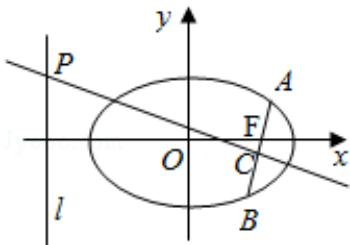

<!-- question-source:start -->
18. (16 分) (2015·江苏) 如图, 在平面直角坐标系 xOy 中, 已知椭圆 $\frac{x^2}{a^2} + \frac{y^2}{b^2} = 1 (a > b > 0)$ 的离心率为 $\frac{\sqrt{2}}{2}$ , 且右焦点 F 到左准线 l 的距离为 3.

(1) 求椭圆的标准方程;

(2) 过 F 的直线与椭圆交于 A, B 两点, 线段 AB 的垂直平分线分别交直线 l 和 AB 于点 P, C, 若 PC=2AB, 求直线 AB 的方程.

<!-- question-source:end -->

![[高中/真题/按年份分类/2015/2015年江苏高考数学试题及答案/填空题/题目/answers/Q00024091A1.md]]
