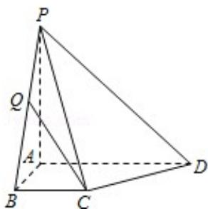

<!-- question-source:start -->
25. (10 分) (2015·江苏) 如图, 在四棱锥 P - ABCD 中, 已知 PA⊥平面 ABCD, 且四边形 ABCD 为直角梯形, $\angle ABC = \angle BAD = \frac{\pi}{2}$ , PA = AD = 2, AB = BC = 1.

(1) 求平面 PAB 与平面 PCD 所成二面角的余弦值；

(2) 点 Q 是线段 BP 上的动点，当直线 CQ 与 DP 所成的角最小时，求线段 BQ 的长.

<!-- question-source:end -->

![[高中/真题/按年份分类/2015/2015年江苏高考数学试题及答案/填空题/题目/answers/Q00024098A1.md]]
