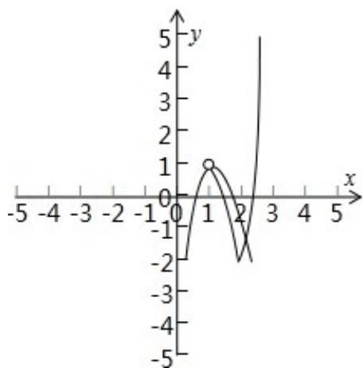
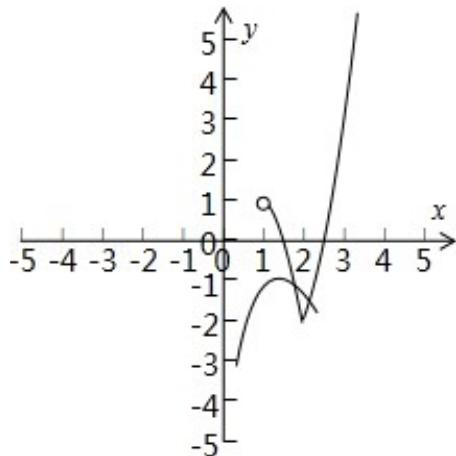

> [!faq]- 2015年江苏高考数学试题及答案解析
>
> > [!success]- **【答案】** 4
>
> > [!note]- **【分析】**
> > ：由 $|f(x)+g(x)|=1$ 可得 $g(x)=-f(x)\pm1$ ，分别作出函数的图象，即可得出结论.
>
> > [!note]- **【解析】**
> > 解：由 $|f(x)+g(x)|=1$ 可得 $g(x)=-f(x)\pm1$ .
> >
> > g (x) 与 h (x) = -f (x) +1 的图象如图所示，图象有两个交点；
> >
> > 
> >
> > g (x) 与 $\varphi(x) = -f(x) - 1$ 的图象如图所示，图象有两个交点；
> >
> > 
> >
> > 所以方程 $|f(x)+g(x)|=1$ 实根的个数为4.
> >
> > 故答案为：4.
> >
> > 点评：本题考查求方程 $|f(x)+g(x)|=1$ 实根的个数，考查数形结合的数学思想，考查学生分析解决问题的能力，属于中档题.
