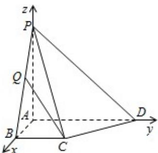

> [!faq]- 2015年江苏高考数学试题及答案解析
>
> > [!success]- **【答案】** 详见解析
>
> > [!note]- **【分析】**
> > 以 A 为坐标原点，以 AB、AD、AP 所在直线分别为 x、y、z 轴建系 A - xyz.
> > （1）所求值即为平面PAB的一个法向量与平面PCD的法向量的夹角的余弦值的绝对值，计算即可；
> > (2) 利用换元法可得 $\cos^2 < \overrightarrow{CQ}, \overrightarrow{DP} > \leqslant \frac{9}{10}$ , 结合函数 $y = \cos x$ 在 $(0, \frac{\pi}{2})$ 上的单调性, 计算即得结论.
>
> > [!note]- **【解析】**
> > 解：以 A 为坐标原点，以 AB、AD、AP 所在直线分别为 x、y、z 轴建系 A - xyz 如图，由题可知 B（1，0，0），C（1，1，0），D（0，2，0），P（0，0，2）。
> > (1) $\because AD \perp$ 平面 $PAB, \therefore \overrightarrow{AD} = (0, 2, 0)$ ，是平面 $PAB$ 的一个法向量，
> >
> > $\because \overrightarrow{PC} = (1, 1, -2), \overrightarrow{PD} = (0, 2, -2)$
> >
> > 设平面 PCD 的法向量为 $\vec{\pi} = (x, y, z)$ ，
> >
> > 由 $\left\{\begin{aligned}\overrightarrow{\mathrm{m}}\cdot\overrightarrow{\mathrm{PC}}=0\\\overrightarrow{\mathrm{m}}\cdot\overrightarrow{\mathrm{PD}}=0\end{aligned}\right.$ ，得 $\left\{\begin{aligned}\mathrm{x}+\mathrm{y}-2\mathrm{z}=0\\\mathrm{2y}-2\mathrm{z}=0\end{aligned}\right.$
> >
> > 取 y=1，得 $\vec{\pi}=(1,1,1)$ ，
> >
> > $$
> > \therefore \cos <   \overrightarrow {A D}, \overrightarrow {\pi} > = \frac {\overrightarrow {A D} \cdot \overrightarrow {m}}{| \overrightarrow {A D} | | \overrightarrow {m} |} = \frac {\sqrt {3}}{3},
> > $$
> >
> > ∴平面PAB与平面PCD所成两面角的余弦值为 $\frac{\sqrt{3}}{3}$
> > (2) $\because \overrightarrow{BP} = (-1, 0, 2)$ ，设 $\overrightarrow{BQ} = \lambda \overrightarrow{BP} = (-\lambda, 0, 2\lambda) \quad (0 \leq \lambda \leq 1)$ ，又 $\overrightarrow{CB} = (0, -1, 0)$ ，则 $\overrightarrow{CQ} = \overrightarrow{CB} + \overrightarrow{BQ} = (-\lambda, -1, 2\lambda)$ ，
> >
> > 又 $\overrightarrow{\mathrm{DP}} = (0, -2, 2)$ ，从而 $\cos < \overrightarrow{\mathrm{CQ}}$ ， $\overrightarrow{\mathrm{DP}} > = \frac{\overrightarrow{\mathrm{CQ}} \cdot \overrightarrow{\mathrm{DP}}}{|\overrightarrow{\mathrm{CQ}}||\overrightarrow{\mathrm{DP}}|} = \frac{1 + 2\lambda}{\sqrt{2 + 10\lambda^2}}$
> >
> > 设 $1 + 2\lambda = t$ ， $\mathfrak{t}\in [1,3]$
> >
> > $$
> > \cos^ {2} <   \overrightarrow {\mathrm{CQ}}, \overrightarrow {\mathrm{DP}} > = \frac {2 t ^ {2}}{5 t ^ {2} - 1 0 t + 9} = \frac {2}{9 \left(\frac {1}{t} - \frac {5}{9}\right) ^ {2} + \frac {2 0}{9}} \leq \frac {9}{1 0},
> > $$
> >
> > 当且仅当 $t = \frac{9}{5}$ ，即 $\lambda = \frac{2}{5}$ 时， $|\cos < \overrightarrow{\mathrm{CQ}}$ ， $\overrightarrow{\mathrm{DP}} >|$ 的最大值为 $\frac{3\sqrt{10}}{10}$ ，
> >
> > 因为 $y = \cos x$ 在 $(0, \frac{\pi}{2})$ 上是减函数，此时直线CQ与DP所成角取得最小值.
> >
> > 又∵ $BP=\sqrt{1^{2}+2^{2}}=\sqrt{5},\therefore BQ=\frac{2}{5}BP=\frac{2\sqrt{5}}{5}.$
> >
> > 
> >
> > 点评：本题考查求二面角的三角函数值，考查用空间向量解决问题的能力，注意解题方法的积累，属于中档题。
