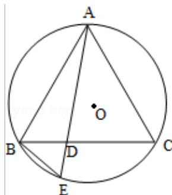

<!-- question-source:start -->
21. (10 分) (2015·江苏) 如图, 在 $\triangle ABC$ 中, $AB = AC$ , $\triangle ABC$ 的外接圆 $\odot O$ 的弦 $AE$ 交 $BC$ 于点 $D$ .

求证： $\triangle ABD \sim \triangle AEB$ 。

【选修4-2：矩阵与变换】
<!-- question-source:end -->

![[高中/真题/按年份分类/2015/2015年江苏高考数学试题及答案/解答题/题目/answers/Q00024094A1.md]]
