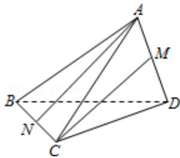

<!-- question-source:start -->
13. (4 分) (2015·浙江) 如图, 三棱锥 A - BCD 中, AB = AC = BD = CD = 3, AD = BC = 2, 点 M, N 分别是 AD, BC 的中点, 则异面直线 AN, CM 所成的角的余弦值是 \_\_\_\_.

<!-- question-source:end -->

![[高中/真题/按年份分类/2015/2015年浙江高考数学_理科_试卷_含答案_/填空题/题目/answers/Q00026179A1.md]]
