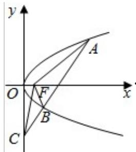

> [!faq]- 2015年浙江高考数学(理科)试卷(含答案)解析
>
> > [!success]- **【答案】** 0；
>
> > [!note]- **【分析】**
> > 根据已知函数可先求 $f(-3)=1$ ，然后代入可求 $f(f(-3))$ ；由于 $x\geq1$ 时， $f(x)=x+\frac{2}{x}-3$ ，当 x<1 时， $f(x)=\lg(x^{2}+1)$ ，分别求出每段函数的取值范围，即可求解
>
> > [!note]- **【解析】**
> > 解： $\because f(x) = \begin{cases} x + \frac{2}{x} - 3, & x \geqslant 1 \\ \lg (x^2 + 1), & x < 1 \end{cases}$ ，
> >
> > $\therefore f(-3)=lg10=1,$
> >
> > 则 $f(f(-3)) = f(1) = 0$ ,
> >
> > 当 $x \geq 1$ 时， $f(x) = x + \frac{2}{x} - 3 \geqslant 2\sqrt{2} - 3$ ，即最小值 $2\sqrt{2} - 3$
> >
> > 当 $x < 1$ 时， $x^2 + 1 \geq 1$ ， $(x) = \lg (x^2 + 1) \geqslant 0$ 最小值 0，
> >
> > 故 $f(x)$ 的最小值是 $2\sqrt{2} - 3$ .
> >
> > 故答案为：0；
> >
> > 
> >
> > 点评：本题主要考查了分段函数的函数值的求解，属于基础试题.
