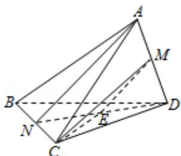

> [!faq]- 2015年浙江高考数学(理科)试卷(含答案)解析
>
> > [!success]- **【答案】** 为： $\frac{7}{8}$ .  点评: 本题考查异面直线所成角的求法, 考查空间想象能力以及计算能力.
>
> > [!note]- **【分析】**
> > 连结 ND, 取 ND 的中点为: E, 连结 ME 说明异面直线 AN, CM 所成的角就是 $\angle$ EMC 通过解三角形, 求解即可.
>
> > [!note]- **【解析】**
> > 分析: 连结 ND, 取 ND 的中点为: E, 连结 ME 说明异面直线 AN, CM 所成的角就是 $\angle$ EMC 通过解三角形, 求解即可.
> >
> > 解答: 解: 连结 ND, 取 ND 的中点为: E, 连结 ME, 则 ME||AN, 异面直线 AN, CM 所成的角就是 $\angle EMC$ ,
> >
> > $$
> > \because \mathrm{AN} = 2 \sqrt {2},
> > $$
> >
> > $$
> > \therefore \mathrm{ME} = \sqrt {2} = \mathrm{EN}, \quad \mathrm{MC} = 2 \sqrt {2},
> > $$
> >
> > 又∵EN⊥NC，∴EC= $\sqrt{EN^{2}+NC^{2}}=\sqrt{3}$ ,
> >
> > $$
> > \therefore \cos \angle E M C = \frac {E M ^ {2} + M C ^ {2} - E C ^ {2}}{2 E M \cdot M C} = \frac {2 + 8 - 3}{2 \times \sqrt {2} \times 2 \sqrt {2}} = \frac {7}{8}.
> > $$
> >
> > 故
> > 答案为： $\frac{7}{8}$ .
> >
> > 
> >
> > 点评: 本题考查异面直线所成角的求法, 考查空间想象能力以及计算能力.
