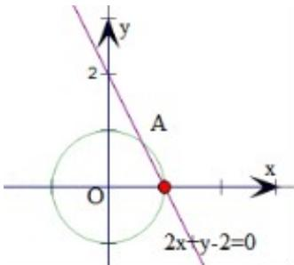

> [!faq]- 2015年浙江高考数学(理科)试卷(含答案)解析
>
> > [!success]- **【答案】** 3。
>
> > [!note]- **【分析】**
> > 根据所给 x, y 的范围，可得 $\left|6 - x - 3y\right| = 6 - x - 3y$ ，再讨论直线 $2x + y - 2 = 0$ 将圆 $x^{2} + y^{2} = 1$ 分成两部分，分别去绝对值，运用线性规划的知识，平移即可得到最小值.
>
> > [!note]- **【解析】**
> > 分析：根据所给 x, y 的范围，可得 $\left|6 - x - 3y\right| = 6 - x - 3y$ ，再讨论直线 $2x + y - 2 = 0$ 将圆 $x^{2} + y^{2} = 1$ 分成两部分，分别去绝对值，运用线性规划的知识，平移即可得到最小值.
> >
> > 解 解：由 $x^{2} + y^{2}\leq 1$ ，可得 $6 - x - 3y > 0$ ，即 $|6 - x - 3y| = 6 - x - 3y$
> >
> > 答：如图直线 $2x + y - 2 = 0$ 将圆 $x^{2} + y^{2} = 1$ 分成两部分，在直线的上方（含直线），即有 $2x + y - 2 \geq 0$ ，即 $|2 + y - 2| = 2x + y - 2$ ，此时 $|2x + y - 2| + |6 - x - 3y| = (2x + y - 2) + (6 - x - 3y) = x - 2y + 4$ ，利用线性规划可得在 A $\left(\frac{3}{5}, \frac{4}{5}\right)$ 处取得最小值 3；在直线的下方（含直线），即有 $2x + y - 2 \leq 0$ ，即 $|2 + y - 2| = -(2x + y - 2)$ ，此时 $|2x + y - 2| + |6 - x - 3y| = -(2x + y - 2) + (6 - x - 3y) = 8 - 3x - 4y$ ，利用线性规划可得在 A $\left(\frac{3}{5}, \frac{4}{5}\right)$ 处取得最小值 3。综上可得，当 $x = \frac{3}{5}$ ， $y = \frac{4}{5}$ 时， $|2x + y - 2| + |6 - x - 3y|$ 的最小值为 3。故答案为：3。
> >
> > 
> >
> > 点 本题考查直线和圆的位置关系，主要考查二元函数在可行域内取得最值的方法，属于中档题.
> >
> > 评：
