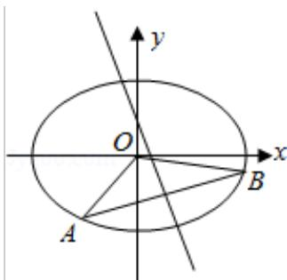

<!-- question-source:start -->
19.（15分）（2015·浙江）已知椭圆 $\frac{x^2}{2} + y^2 = 1$ 上两个不同的点A，B关于直线 $y = mx + \frac{1}{2}$ 对称.

(1) 求实数 $\mathrm{m}$ 的取值范围；

(2) 求 $\triangle AOB$ 面积的最大值（O 为坐标原点）.

<!-- question-source:end -->

![[高中/真题/按年份分类/2015/2015年浙江高考数学_理科_试卷_含答案_/解答题/题目/answers/Q00026185A1.md]]
