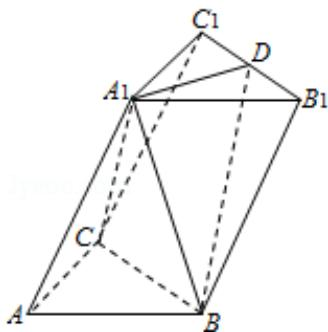

<!-- question-source:start -->
17. （15 分）（2015·浙江）如图，在三棱柱 ABC - A₁B₁C₁ 中，

$\angle \mathrm{BAC} = 90^{\circ}$ ， $\mathrm{AB} = \mathrm{AC} = 2$ ， $\mathrm{A}_1\mathrm{A} = 4$ ， $\mathrm{A}_1$ 在底面ABC的射影为BC的中点，D是 $\mathrm{B_1C_1}$ 的中点.
（1）证明： $\mathrm{A}_1\mathrm{D}\bot$ 平面 $\mathrm{A}_1\mathrm{BC}$

(2) 求二面角 $A_{1} - BD - B_{1}$ 的平面角的余弦值.

<!-- question-source:end -->

![[高中/真题/按年份分类/2015/2015年浙江高考数学_理科_试卷_含答案_/解答题/题目/answers/Q00029541A1.md]]
