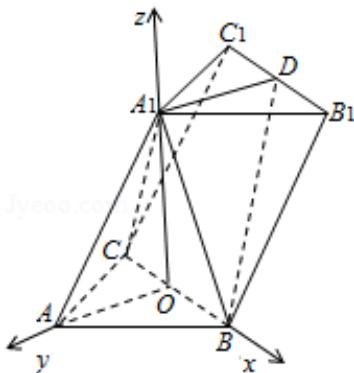

> [!faq]- 2015年浙江高考数学(理科)试卷(含答案)解析
>
> > [!success]- **【答案】** 详见解析
>
> > [!note]- **【分析】**
> > （1）以 BC 中点 O 为坐标原点，以 OB、OA、 $OA_{1}$ 所在直线分别为 x、y、z 轴建系，通过 $\overrightarrow{A_{1}D} \cdot \overrightarrow{OA_{1}} = \overrightarrow{A_{1}D} \cdot \overrightarrow{BC} = 0$ 及线面垂直的判定定理即得结论；
>
> > [!note]- **【解析】**
> > 分析：（1）以 BC 中点 O 为坐标原点，以 OB、OA、 $OA_{1}$ 所在直线分别为 x、y、z 轴建系，通过 $\overrightarrow{A_{1}D} \cdot \overrightarrow{OA_{1}} = \overrightarrow{A_{1}D} \cdot \overrightarrow{BC} = 0$ 及线面垂直的判定定理即得结论；
> >
> > (2) 所求值即为平面 $\mathrm{A}_{1} \mathrm{BD}$ 的法向量与平面 $\mathrm{B}_{1} \mathrm{BD}$ 的法向量的夹角的余弦值的绝对值的相反数，计算即可.
> >
> > 解答: (1) 证明: 如图, 以 BC 中点 O 为坐标原点, 以 OB、OA、 $\mathrm{OA}_{1}$ 所在直线分别为 x、y、z 轴建系.
> >
> > 则 $\mathrm{BC} = \sqrt{2}\mathrm{AC} = 2\sqrt{2},\mathrm{A}_1\mathrm{O} = \sqrt{\mathrm{AA}_1^2 - \mathrm{AO}^2} = \sqrt{14},$
> >
> > 易知 $\mathrm{A}_1$ （0，0， $\sqrt{14}$ ），B（ $\sqrt{2}$ ，0，0），C（- $\sqrt{2}$ ，0，0），
> >
> > $$
> > A (0, \sqrt {2}, 0), D (0, - \sqrt {2}, \sqrt {1 4}), B _ {1} (\sqrt {2}, - \sqrt {2}, \sqrt {1 4})
> > $$
> >
> > $$
> > \overrightarrow {\mathrm{A} _ {1} \mathrm{D}} = (0, - \sqrt {2}, 0), \overrightarrow {\mathrm{BD}} = (- \sqrt {2}, - \sqrt {2}, \sqrt {1 4})
> > $$
> >
> > $$
> > \overrightarrow {\mathrm{B} _ {1} \mathrm{D}} = (- \sqrt {2}, 0, 0), \overrightarrow {\mathrm{BC}} = (- 2 \sqrt {2}, 0, 0), \overrightarrow {\mathrm{OA} _ {1}} = (0, 0, \sqrt {1 4})
> > $$
> >
> > $$
> > \because \overrightarrow {\mathrm{A} _ {1} \mathrm{D}} \cdot \overrightarrow {\mathrm{OA} _ {1}} = 0, \therefore \mathrm{A} _ {1} \mathrm{D} \perp \mathrm{OA} _ {1},
> > $$
> >
> > 又∵ $\overrightarrow{A_{1}D}\cdot\overrightarrow{BC}=0,\therefore A_{1}D\perp BC,$
> >
> > 又∵ $OA_{1}\cap BC=O$ ，∴ $A_{1}D\perp$ 平面 $A_{1}BC$ ;
> >
> > (2) 解: 设平面 $\mathrm{A}_{1} \mathrm{BD}$ 的法向量为 $\vec{\pi} = (x, y, z)$ ,
> >
> > 由 $\left\{ \begin{array}{l} \overrightarrow{\mathrm{m}} \cdot \overrightarrow{\mathrm{A}_1\mathrm{D}} = 0 \\ \overrightarrow{\mathrm{m}} \cdot \overrightarrow{\mathrm{BD}} = 0 \end{array} \right.$ ，得 $\left\{ \begin{array}{l} -\sqrt{2}\mathrm{y} = 0 \\ -\sqrt{2}\mathrm{x} - \sqrt{2}\mathrm{y} + \sqrt{14}\mathrm{z} = 0 \end{array} \right.$
> >
> > 取 $z = 1$ ，得 $\vec{\pi} = (\sqrt{7},0,1)$
> >
> > 设平面 $\mathrm{B}_1\mathrm{BD}$ 的法向量为 $\vec{\mathfrak{n}} = (\mathbf{x},\mathbf{y},\mathbf{z})$ ，
> >
> > 由 $\left\{ \begin{array}{l} \overrightarrow{\mathrm{n}} \cdot \overrightarrow{\mathrm{B}_1\mathrm{D}} = 0 \\ \overrightarrow{\mathrm{n}} \cdot \overrightarrow{\mathrm{BD}} = 0 \end{array} \right.$ ，得 $\left\{ \begin{array}{l} -\sqrt{2}\mathrm{x} - \sqrt{2}\mathrm{y} + \sqrt{14}\mathrm{z} = 0 \\ -\sqrt{2}\mathrm{x} = 0 \end{array} \right.$ ，
> >
> > 取 z=1，得 $\vec{n}=(0,\sqrt{7},1)$ ，
> >
> > $$
> > \therefore \cos <   \vec {\pi}, \vec {n} > = \frac {\vec {m} \cdot \vec {n}}{| \vec {m} | | \vec {n} |} = \frac {1}{2 \sqrt {2} \times 2 \sqrt {2}} = \frac {1}{8},
> > $$
> >
> > 又∵该二面角为钝角，
> >
> > ∴二面角 $A_{1}-BD-B_{1}$ 的平面角的余弦值为 $-\frac{1}{8}$ .
> >
> > 
> >
> > 点评：本题考查空间中线面垂直的判定定理，考查求二面角的三角函数值，注意解题方法的积累，属于中档题.
