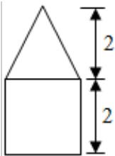

<!-- question-source:start -->
1.（5分）（2015·浙江）已知集合 $P = \{x|x^2 - 2x \geq 0\}$ ， $Q = \{x|1 < x \leq 2\}$ ，则 $(C_R P) \cap Q = (\quad)$ A. [0, 1) B. (0, 2] C. (1, 2) D. [1, 2]

<!-- question-source:end -->

![[高中/真题/按年份分类/2015/2015年浙江高考数学_理科_试卷_含答案_/选择题/题目/answers/Q00026168A1.md]]
