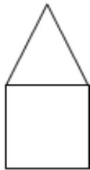
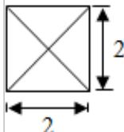

<!-- question-source:start -->
2. (5 分) (2015·浙江) 某几何体的三视图如图所示 (单位: cm), 则该几何体的体积是 ( )

主视图  
  
侧视图

俯视图A. $8\mathrm{cm}^3$ B. $12\mathrm{cm}^3$ C. $\frac{32}{3}\mathrm{cm}^3$ D. $\frac{40}{3}\mathrm{cm}^3$

$$
\{\mathrm{a} _ {\mathrm{n}} \}
$$

$$
S _ {n},
$$

$$
\mathrm{a} _ {4}, \mathrm{a} _ {8}
$$

$$
\mathrm{a} _ {1} \mathrm{d} > 0
$$

$$
\mathrm{dS} _ {4} > 0 \mathrm{B}
$$

$$
\mathrm{a} _ {1} \mathrm{d} <   0
$$

$$
\mathrm{dS} _ {4} <   0 \mathrm{C}
$$

$$
\mathrm{a} _ {1} \mathrm{d} > 0
$$

$$
\mathrm{dS} _ {4} <   0 \mathrm{D}
$$

$$
\mathrm{a} _ {1} \mathrm{d} <   0
$$

$$
\mathrm{dS} _ {4} > 0
$$
<!-- question-source:end -->

![[高中/真题/按年份分类/2015/2015年浙江高考数学_理科_试卷_含答案_/选择题/题目/answers/Q00026169A1.md]]
