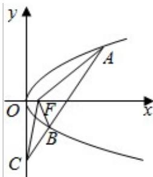

<!-- question-source:start -->
5.（5分）(2015·浙江)如图，设抛物线 $y^{2}=4x$ 的焦点为F，不经过焦点的直线上有三个不同的点A，B，C，其中点A，B在抛物线上，点C在y轴上，则△BCF与△ACF的面积之比是（）

A. $\frac{|\mathrm{BF}| - 1}{|\mathrm{AF}| - 1}$ B. $\frac{|\mathrm{BF}|^2 - 1}{|\mathrm{AF}|^2 - 1}$ C. $\frac{|\mathrm{BF}| + 1}{|\mathrm{AF}| + 1}$ D. $\frac{|\mathrm{BF}|^2 + 1}{|\mathrm{AF}|^2 + 1}$
<!-- question-source:end -->

![[高中/真题/按年份分类/2015/2015年浙江高考数学_理科_试卷_含答案_/选择题/题目/answers/Q00026171A1.md]]
