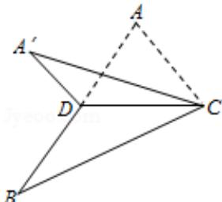

<!-- question-source:start -->
8.（5分）（2015·浙江）如图，已知 $\triangle ABC$ ，D是AB的中点，沿直线CD将 $\triangle ACD$ 折成 $\triangle A^{\prime}CD$ ，所成二面角 $A^{\prime} - CD - B$ 的平面角为 $\alpha$ ，则（ ）

A. $\angle A^{\prime}DB\leq \alpha$ B. $\angle A^{\prime}DB\geq \alpha$ C. $\angle A^{\prime}CB\leq \alpha$ D. $\angle A^{\prime}CB\geq \alpha$

##
<!-- question-source:end -->

![[高中/真题/按年份分类/2015/2015年浙江高考数学_理科_试卷_含答案_/选择题/题目/answers/Q00029539A1.md]]
