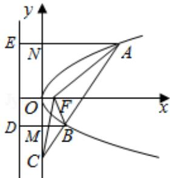

> [!faq]- 2015年浙江高考数学(理科)试卷(含答案)解析
>
> > [!success]- **【答案】** 详见解析
>
> > [!note]- **【分析】**
> > 根据抛物线的定义，将三角形的面积关系转化为 $\frac{|BC|}{|AC|}$ 的关系进行求解即可.
>
> > [!note]- **【解析】**
> > 分析：根据抛物线的定义，将三角形的面积关系转化为 $\frac{|BC|}{|AC|}$ 的关系进行求解即可.
> >
> > 解答：解：如图所示，抛物线的准线 DE 的方程为 x = -1，
> >
> > $$
> > \mathrm{AE} \perp \mathrm{DE}
> > $$
> >
> > $$
> > \mathrm{BD} \bot \mathrm{DE}
> > $$
> >
> > $$
> > \mathrm{BF} = \mathrm{BD}, \quad \mathrm{AF} = \mathrm{AE}
> > $$
> >
> > 则 $|BM|=|BD|-1=|BF|-1,$
> >
> > $$
> > | \mathrm{AN} | = | \mathrm{AE} | - 1 = | \mathrm{AF} | - 1,
> > $$
> >
> > 则 $\frac{S_{\triangle BCF}}{S_{\triangle ACF}} = \frac{|BC|}{|AC|} = \frac{|BM|}{|AN|} = \frac{|BF| - 1}{|AF| - 1},$
> >
> > 故选：A
> >
> > 
> >
> > 点评：本题主要考查三角形的面积关系，利用抛物线的定义进行转化是解决本题的关键.
