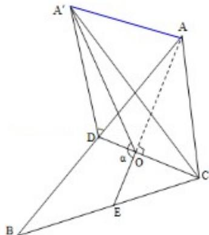

> [!faq]- 2015年浙江高考数学(理科)试卷(含答案)解析
>
> > [!success]- **【答案】** 详见解析
>
> > [!note]- **【分析】**
> > 解：画出图形，分 AC=BC，AC≠BC 两种情况讨论即可.
>
> > [!note]- **【解析】**
> > 分析：解：画出图形，分 AC=BC，AC≠BC 两种情况讨论即可.
> >
> > 解答：解：①当 AC=BC 时， $\angle A^{\prime}DB=\alpha;$
> >
> > ② 当 AC≠BC 时，如图，点 A' 投影在 AE 上，
> >
> > $\alpha=\angle A^{\prime}OE$ ，连结 $AA^{\prime}$ ，
> >
> > 易得 $\angle ADA'$ $< \angle AOA'$ ,
> >
> > $\therefore\angle A^{\prime}DB>\angle A^{\prime}OE$ ，即 $\angle A^{\prime}DB>\alpha$
> >
> > 综上所述， $\angle A^{\prime}DB \geq \alpha$
> >
> > 故选：B.
> >
> > 
> >
> > 点评：本题考查空间角的大小比较，注意解题方法的积累，属于中档题.
> >
> > ##
> > 二、填空题：本大题共7小题，多空题每题6分，单空题每题4分，共36分.
