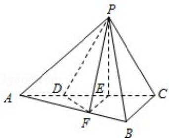

<!-- question-source:start -->
20. (12 分) (2015·重庆) 如题图, 三棱锥 P - ABC 中, 平面 PAC⊥平面 ABC, $\angle ABC = \frac{\pi}{2}$ , 点 D、E 在线段 AC 上, 且 AD=DE=EC=2, PD=PC=4, 点 F 在线段 AB 上, 且 EF∥BC.

(Ⅰ) 证明: AB⊥平面 PFE.

（Ⅱ）若四棱锥 P - DFBC 的体积为 7，求线段 BC 的长.

<!-- question-source:end -->

![[高中/真题/按年份分类/2015/2015年重庆市高考数学试卷_文科_含答案/解答题/题目/answers/Q00023030A1.md]]
