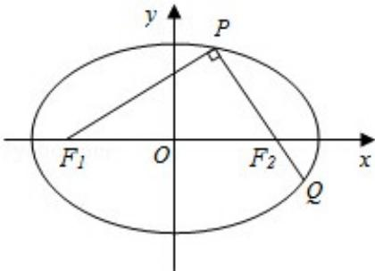

<!-- question-source:start -->
21. (13分) (2015·重庆) 如题图, 椭圆 $\frac{x^2}{a^2} + \frac{y^2}{b^2} = 1 (a > b > 0)$ 的左右焦点分别为 $F_1, F_2$ , 且过 $F_2$ 的直线交椭圆于 $P$ , $Q$ 两点, 且 $PQ \perp PF_1$ .

（Ⅰ）若 $\left|PF_{1}\right|=2+\sqrt{2}$ ， $\left|PF_{2}\right|=2-\sqrt{2}$ ，求椭圆的标准方程.

（II）若 $|PQ|=\lambda|PF_{1}|$ ，且 $\frac{3}{4}\leqslant\lambda<\frac{4}{3}$ ，试确定椭圆离心率e的取值范围.

# 2015 年重庆市高考数学试卷（文科）

参考答案与试题解析

##
一、选择题: 本大题共 10 小题, 每小题 5 分, 共 50 分, 在每小题给出的四个选项中, 只有一项是符合题目要求的.
<!-- question-source:end -->

![[高中/真题/按年份分类/2015/2015年重庆市高考数学试卷_文科_含答案/解答题/题目/answers/Q00031006A1.md]]
