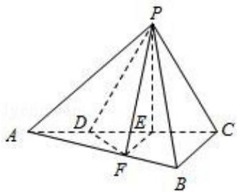

> [!faq]- 2015年重庆市高考数学试卷(文科)含答案解析
>
> > [!success]- **【答案】** 详见解析
>
> > [!note]- **【分析】**
> > （Ⅰ）由等腰三角形的性质可证 PE⊥AC，可证 PE⊥AB。又 EF∥BC，可证 AB⊥EF，从而 AB 与平面 PEF 内两条相交直线 PE，EF 都垂直，可证 AB⊥平面 PEF。
>
> > [!note]- **【解析】**
> > 解：（Ⅰ）如图，由 DE=EC, PD=PC 知，E 为等腰△PDC 中 DC 边的中点，故 PE⊥AC，又平面 PAC⊥平面 ABC，平面 PAC∩平面 ABC=AC，PEC 平面 PAC，PE⊥AC，所以 PE⊥平面 ABC，从而 PE⊥AB.
> >
> > 因为 $\angle ABC=\frac{\pi}{2}$ ，EF∥BC，
> >
> > 故 AB⊥EF，
> >
> > 从而 AB 与平面 PEF 内两条相交直线 PE，EF 都垂直，
> >
> > 所以 AB⊥平面 PEF.
> >
> > （Ⅱ）设 BC=x，则在直角△ABC 中， $AB=\sqrt{AC^{2}-BC^{2}}=\sqrt{36-x^{2}}$ 从而 $S_{\triangle ABC}=\frac{1}{2}AB\cdot BC=\frac{1}{2}x\sqrt{36-x^{2}}$ 由 EF∥BC 知 $\frac{AF}{AB}=\frac{AE}{AC}=\frac{2}{3}$ ，得 $\triangle AFE\cong\triangle ABC$ 故 $\frac{S_{\triangle AFE}}{S_{\triangle ABC}}=(\frac{2}{3})^{2}=\frac{4}{9}$ ，即 $S_{\triangle AFE}=\frac{4}{9}S_{\triangle ABC}$ 由 AD= $\frac{1}{2}AE$ ， $S_{\triangle AFD}=\frac{1}{2}S_{\triangle AFE}=\frac{1}{2}\cdot\frac{4}{9}S_{\triangle ABC}=\frac{2}{9}S_{\triangle ABC}=\frac{1}{9}\sqrt{36-x^{2}}$ 从而四边形 DFBC 的面积为： $S_{DFBC}=S_{\triangle ABC}-S_{AFD}=\frac{1}{2}\sqrt{36-x^{2}}-\frac{1}{9}\sqrt{36-x^{2}}=\frac{7}{18}\sqrt{36-x^{2}}$ 由（Ⅰ）知，PE⊥平面 ABC，所以 PE 为四棱锥 P-DFBC 的高.
> >
> > 在直角△PEC 中， $PE=\sqrt{PC^{2}-EC^{2}}=\sqrt{4^{2}-2^{2}}=2\sqrt{3}$ 故体积 $V_{P-DFBC}=\frac{1}{3}\cdot S_{DFBC}\cdot PE=\frac{1}{3}\cdot\frac{7}{18}x\sqrt{36-x^{2}}\cdot2\sqrt{3}=7$ 故得 $x^{4}-36x^{2}+243=0$ ，解得 $x^{2}=9$ 或 $x^{2}=27$ ，由于 x>0，可得 x=3 或 $x=3\sqrt{3}$ 所以：BC=3 或 BC= $3\sqrt{3}$ .
> >
> > 
> >
> > 点评：本题主要考查了直线与平面垂直的判定，棱柱、棱锥、棱台的体积的求法，考查了空间想象能力和推理论证能力，考查了转化思想，属于中档题.
