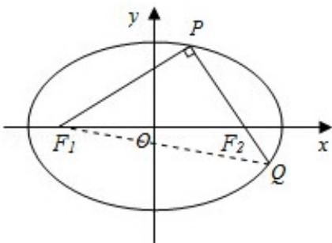

> [!faq]- 2015年重庆市高考数学试卷(文科)含答案解析
>
> > [!success]- **【答案】** 详见解析
>
> > [!note]- **【分析】**
> > (I) 由椭圆的定义可得: $2a = |PF_1| + |PF_2|$ , 解得 a. 设椭圆的半焦距为 c, 由于 PQ⊥PF $_1$ , 利用勾股定理可得 $2c = |F_1F_2| = \sqrt{|PF_1|^2 + |PF_2|^2}$ , 解得 c. 利用 $b^2 = a^2 - c^2$ . 即可得出椭圆的标准方程.
>
> > [!note]- **【解析】**
> > 分析：(I) 由椭圆的定义可得: $2a = |PF_1| + |PF_2|$ , 解得 a. 设椭圆的半焦距为 c, 由于 PQ⊥PF $_1$ , 利用勾股定理可得 $2c = |F_1F_2| = \sqrt{|PF_1|^2 + |PF_2|^2}$ , 解得 c. 利用 $b^2 = a^2 - c^2$ . 即可得出椭圆的标准方程.
> >
> > (II) 如图所示, 由 $\mathrm{PQ} \perp \mathrm{PF}_1$ , $|\mathrm{PQ}| = \lambda |\mathrm{PF}_1|$ , 可得 $|\mathrm{QF}_1| = \sqrt{1 + \lambda^2 |\mathrm{PF}_1|}$ , 由椭圆的定义可得: $|\mathrm{PF}_1| + |\mathrm{PQ}| + |\mathrm{QF}_1| = 4\mathrm{a}$ , 解得 $|\mathrm{PF}_1| = \frac{4\mathrm{a}}{1 + \lambda + \sqrt{1 + \lambda^2}}$ . $|\mathrm{PF}_2| = 2\mathrm{a} - |\mathrm{PF}_1|$ , 由勾股定理可得: $2\mathrm{c} = |\mathrm{F}_1\mathrm{F}_2| = \sqrt{| \mathrm{PF}_1|^2 + |\mathrm{PF}_2|^2}$ , 代入化简. 令 $t = 1 + \lambda + \sqrt{1 + \lambda^2}$ , 则上式化为 $\mathrm{e}^2 = 8\left(\frac{1}{t} - \frac{1}{4}\right)^2 + \frac{1}{2}$ , 解出即可.
> >
> > 解答：解：（I）由椭圆的定义可得： $2a=|PF_{1}|+|PF_{2}|=(2+\sqrt{2})+(2-\sqrt{2})=4$ ，解得 a=2。设椭圆的半焦距为 c，∵PQ⊥PF₁，
> > ∴ $2c = |F_{1}F_{2}| = \sqrt{|PF_{1}|^{2} + |PF_{2}|^{2}} = \sqrt{(2 + \sqrt{2})^{2} + (2 - \sqrt{2})^{2}} = 2\sqrt{3}$ ,
> > ∴ $c=\sqrt{3}$ .
> > ∴ $b^{2}=a^{2}-c^{2}=1$ .
> > ∴ 椭圆的标准方程为 $\frac{x^{2}}{4} + y^{2} = 1$ .
> > （II）如图所示，由 PQ⊥PF₁，|PQ|=λ|PF₁|
> > ∴ $|QF_{1}|=\sqrt{|PF_{1}|^{2}+|PQ|^{2}}=\sqrt{1+\lambda^{2}}|PF_{1}|$ 由椭圆的定义可得： $2a=|PF_{1}|+|PF_{2}|=|QF_{1}|+|QF_{2}|$
> >
> > $$
> > \therefore \left| \mathrm{PF} _ {1} \right| + \left| \mathrm{PQ} \right| + \left| \mathrm{QF} _ {1} \right| = 4 \mathrm{a},
> > $$
> >
> > ∴ $(1+\lambda+\sqrt{1+\lambda^{2}})$ $|PF_{1}|=4a$ ，解得 $|PF_{1}|=\frac{4a}{1+\lambda+\sqrt{1+\lambda^{2}}}$ .
> >
> > $|\mathrm{PF}_2| = 2a - |\mathrm{PF}_1| = \frac{2a(\lambda + \sqrt{1 + \lambda^2} - 1)}{1 + \lambda + \sqrt{1 + \lambda^2}}$
> >
> > 由勾股定理可得： $2\mathrm{c} = |\mathrm{F}_1\mathrm{F}_2| = \sqrt{\left|\mathrm{PF}_1\right|^2 + \left|\mathrm{PF}_2\right|^2},$
> >
> > $$
> > \left(\frac {4 a}{1 + \lambda + \sqrt {1 + \lambda^ {2}}}\right) ^ {2} + \left[ \frac {2 a (\lambda + \sqrt {1 + \lambda^ {2}} - 1)}{1 + \lambda + \sqrt {1 + \lambda^ {2}}} \right] ^ {2} = 4 c ^ {2},
> > $$
> >
> > $$
> > \therefore \frac {4}{(1 + \lambda + \sqrt {1 + \lambda^ {2}})} 2 ^ {+} \frac {\left(\lambda + \sqrt {1 + \lambda^ {2}} - 1\right) ^ {2}}{(1 + \lambda + \sqrt {1 + \lambda^ {2}})} 2 = e ^ {2}.
> > $$
> >
> > 令 $t = 1 + \lambda +\sqrt{1 + \lambda^2}$ ，则上式化为 $\mathrm{e}^2 = \frac{4 + (t - 2)^2}{t^2} = 8\left(\frac{1}{t} -\frac{1}{4}\right)^2 +\frac{1}{2},$ $\because t = 1 + \lambda +\sqrt{1 + \lambda^2}$ ，且 $\frac{3}{4}\leqslant \lambda <  \frac{4}{3},$ $\therefore t$ 关于 $\lambda$ 单调递增， $\therefore 3\leq t <   4.\therefore \frac{1}{4} <  \frac{1}{t}\leqslant \frac{1}{3},$ $\therefore \frac{1}{2} < e^{2}\leqslant \frac{5}{9}$ ，解得 $\frac{\sqrt{2}}{2} <  e\leqslant \frac{\sqrt{5}}{3}.$ $\therefore$ 椭圆离心率的取值范围是 $(\frac{\sqrt{2}}{2},\frac{\sqrt{5}}{3} ]$
> >
> > 
> >
> > 点评：本题考查了椭圆的定义标准方程及其性质、勾股定理、不等式的性质、“换元法”，考查了推理能力与计算能力，属于中档题.
