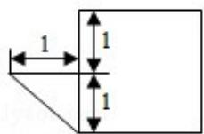
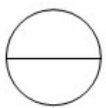
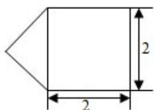

<!-- question-source:start -->
5. （5分）（2015·重庆）某几何体的三视图如图所示，则该几何体的体积为（）

  
正视图

  
左视图

  
俯视图

A $\frac{1}{3} + 2\pi$ B $\frac{13\pi}{6}$ C $\frac{7\pi}{3}$ D $\frac{5\pi}{2}$
<!-- question-source:end -->

![[高中/真题/按年份分类/2015/2015年重庆市高考数学试卷_文科_含答案/选择题/题目/answers/Q00023015A1.md]]
