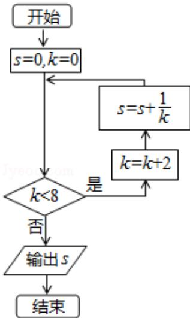

<!-- question-source:start -->
8. （5 分）（2015·重庆）执行如图所示的程序框图，则输出 s 的值为（）

A 3 B 5 C 11 D 25
. 4 . 6 . 12 . 24
<!-- question-source:end -->

![[高中/真题/按年份分类/2015/2015年重庆市高考数学试卷_文科_含答案/选择题/题目/answers/Q00023018A1.md]]
