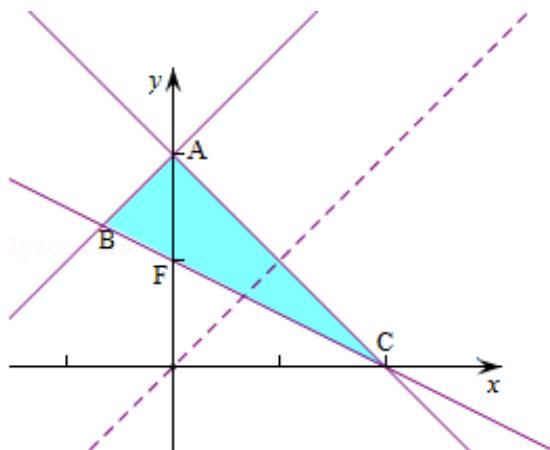

> [!faq]- 2015年重庆市高考数学试卷(文科)含答案解析
>
> > [!success]- **【答案】** 填写在答题卡相应位置上.
>
> > [!note]- **【分析】**
> > 作出不等式组对应的平面区域，求出三角形各顶点的坐标，利用三角形的面积公式进行求解即可.
>
> > [!note]- **【解析】**
> > 解：作出不等式组对应的平面区域如图：
> > 若表示的平面区域为三角形，
> > 由 $\left\{\begin{aligned}x+y-2&=0\\ x+2y&-2=0\end{aligned}\right.$ ，得 $\left\{\begin{aligned}x&=2\\ y&=0\end{aligned}\right.$ ，即C（2，0），
> > 则C（2，0）在直线x-y+2m=0的下方，
> > 即2+2m>0，
> > 则m>-1，
> > 则C（2，0），F（0，1），
> > 由 $\left\{\begin{aligned}x-y+2m&=0\\ x+y&-2=0\end{aligned}\right.$ ，解得 $\left\{\begin{aligned}x&=1-m\\ y&=1+m\end{aligned}\right.$ ，即A（1-m，1+m），
> > 由 $\left\{\begin{aligned}x-y+2m&=0\\ x+2y&-2=0\end{aligned}\right.$ ，解得 $\left\{\begin{aligned}x&=\frac{2-4m}{3}\\ y&=\frac{2+2m}{3}\end{aligned}\right.$ ，即B $\left(\frac{2-4m}{3},\frac{2+2m}{3}\right)$ 。
> > |AF|=1+m-1=m，
> > 则三角形ABC的面积 $S=\frac{1}{2}\times m\times2+\frac{1}{2}\times m\times(-\frac{2-4m}{3})=\frac{4}{3}$ 即 $m^{2}+m-2=0$ 解得m=1或m=-2（舍），
> > 故选：B
> >
> > 
> >
> > 点评：本题主要考查线性规划以及三角形面积的计算，求出交点坐标，结合三角形的面积公式是解决本题的关键.
> >
> > ##
> > 二、填空题：本大题共5小题，每小题5分，共25分.把
