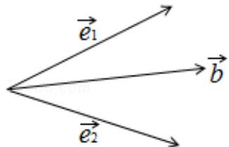

> [!faq]- 2015年高考浙江文科数学试题及答案(精校版)解析
>
> > [!success]- **【答案】** 为： $\frac{2\sqrt{3}}{3}$  点评：本题简单的考查了平面向量的运算，数量积的定义，几何图形的运用，属于容易题，关键是判断夹角即可.
>
> > [!note]- **【分析】**
> > 根据数量积得出 $\vec{e}_1$ , $\vec{e}_2$ 夹角为 $60^\circ$ , $<\vec{b}$ , $\vec{e}_1> = <\vec{b}$ , $\vec{e}_2> = 30^\circ$ , 运用数量积的定义判断求解即可.
>
> > [!note]- **【解析】**
> > 分析: 根据数量积得出 $\vec{e}_1$ , $\vec{e}_2$ 夹角为 $60^\circ$ , $<\vec{b}$ , $\vec{e}_1> = <\vec{b}$ , $\vec{e}_2> = 30^\circ$ , 运用数量积的定义判断求解即可.
> >
> > 解答：解： $\because \vec{e_1},\vec{e_2}$ 是平面单位向量，且 $\vec{e_1}\cdot \vec{e_2} = \frac{1}{2},$
> >
> > $\therefore \vec{e}_{1}, \vec{e}_{2}$ 夹角为 $60^{\circ}$ ,
> >
> > ∵平衡向量 $\vec{b}$ 满足 $\vec{b}\cdot\vec{e}_{1}=\vec{b}\cdot\vec{e}_{2}=1$
> >
> > ∴ $\vec{b}$ 与 $\vec{e1}$ ， $\vec{e2}$ 夹角相等，且为锐角，
> >
> > ∴ $\vec{b}$ 应该在 $\vec{e1}$ ， $\vec{e2}$ 夹角的平分线上，
> >
> > 即 $<\vec{b}, \vec{e}_{1}>=<\vec{b}, \vec{e}_{2}>=30^{\circ}$ ,
> >
> > $$
> > | \overrightarrow {b} | \times 1 \times \cos 3 0 ^ {\circ} = 1,
> > $$
> >
> > $$
> > \therefore | \overrightarrow {b} | = \frac {2 \sqrt {3}}{3}
> > $$
> >
> > 故
> > 答案为： $\frac{2\sqrt{3}}{3}$
> >
> > 
> >
> > 点评：本题简单的考查了平面向量的运算，数量积的定义，几何图形的运用，属于容易题，关键是判断夹角即可.
