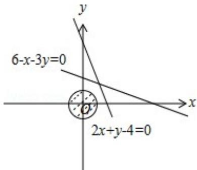
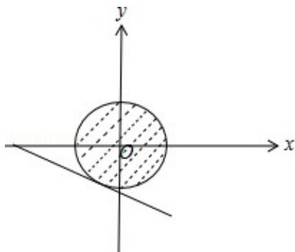

> [!faq]- 2015年高考浙江文科数学试题及答案(精校版)解析
>
> > [!success]- **【答案】** 为：15. 点评：本题考查了简单的线性规划，考查了数形结合的解题思想方法，考查了数学转化思想方法，是中档题.
>
> > [!note]- **【分析】**
> > 由题意可得 $2x + y - 4 < 0$ , $6 - x - 3y > 0$ , 去绝对值后得到目标函数 $z = -3x - 4y + 10$ , 然后结合圆心到直线的距离求得 $|2x + y - 4| + |6 - x - 3y|$ 的最大值.
>
> > [!note]- **【解析】**
> > 分析: 由题意可得 $2x + y - 4 < 0$ , $6 - x - 3y > 0$ , 去绝对值后得到目标函数 $z = -3x - 4y + 10$ , 然后结合圆心到直线的距离求得 $|2x + y - 4| + |6 - x - 3y|$ 的最大值.
> >
> > 解答： 解：如图，
> >
> > 
> >
> > 由 $x^{2}+y^{2}\leq1$ ，
> >
> > 可得 $2x+y-4<0,\quad6-x-3y>0,$
> >
> > 则 $|2x+y-4|+|6-x-3y|=-2x-y+4+6-x-3y=-3x-4y+10,$ 令 $z = -3x - 4y + 10$ ，得 $y = -\frac{3}{4} x - \frac{z}{4} +\frac{5}{2}$ 如图，
> >
> > 
> >
> > 要使 $z = -3x - 4y + 10$ 最大，则直线 $y = -\frac{3}{4} x - \frac{z}{4} + \frac{5}{2}$ 在 $y$ 轴上的截距最小，由 $z = -3x - 4y + 10$ ，得 $3x + 4y + z - 10 = 0$
> >
> > 则 $\frac{|z-10|}{5}=1$ ，即z=15或z=5。
> >
> > 由题意可得 z 的最大值为 15.
> >
> > 故
> > 答案为：15.
> >
> > 点评：本题考查了简单的线性规划，考查了数形结合的解题思想方法，考查了数学转化思想方法，是中档题.
