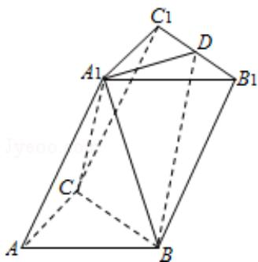

<!-- question-source:start -->
18. （15分）（2015·浙江）如图，在三棱柱 $\mathrm{ABC - A_1B_1C_1}$ 中，

$\angle BAC = 90^{\circ}$ ， $AB = AC = 2$ ， $\mathrm{A}_{1}\mathrm{A} = 4$ ， $\mathrm{A}_{1}$ 在底面ABC的射影为BC的中点，D是 $\mathrm{B}_1\mathrm{C}_1$ 的中点.（I）证明： $\mathrm{A}_1\mathrm{D}\bot$ 平面 $\mathrm{A}_1\mathrm{BC}$

（Ⅱ）求直线 $A_{1}B$ 和平面 $BB_{1}C_{1}C$ 所成的角的正弦值.

<!-- question-source:end -->

![[高中/真题/按年份分类/2015/2015年高考浙江文科数学试题及答案_精校版_/解答题/题目/answers/Q00023589A1.md]]
