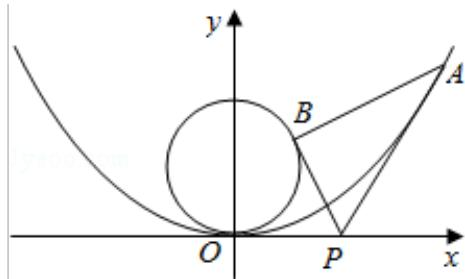

<!-- question-source:start -->
19. (15 分) (2015·浙江) 如图, 已知抛物线 $C_1: y = \frac{1}{4} x^2$ , 圆 $C_2: x^2 + (y - 1)^2 = 1$ , 过点 $P(t, 0) (t > 0)$ 作不过原点 O 的直线 PA, PB 分别与抛物线 $C_1$ 和圆 $C_2$ 相切, A, B 为切点.

（Ⅰ）求点 A，B 的坐标；

（Ⅱ）求△PAB 的面积.

注：直线与抛物线有且只有一个公共点，且与抛物线的对称轴不平行，则称该直线与抛物线相切，称该公共点为切点.

<!-- question-source:end -->

![[高中/真题/按年份分类/2015/2015年高考浙江文科数学试题及答案_精校版_/解答题/题目/answers/Q00023590A1.md]]
