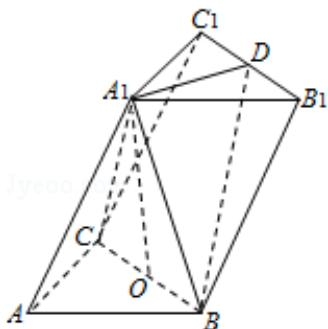
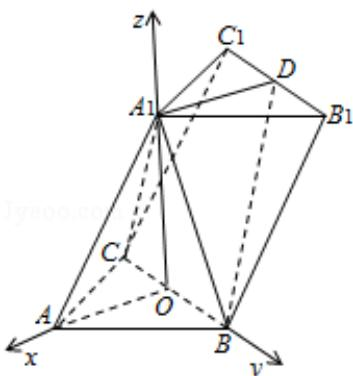

> [!faq]- 2015年高考浙江文科数学试题及答案(精校版)解析
>
> > [!success]- **【答案】** 详见解析
>
> > [!note]- **【分析】**
> > (I) 连接 AO, A₁D, 根据几何体的性质得出 A₁O⊥A₁D, A₁D⊥BC, 利用直线平面的垂直定理判断.
>
> > [!note]- **【解析】**
> > 证明：（I）∵AB=AC=2，D是 $B_{1}C_{1}$ 的中点.
> >
> > $$
> > \therefore \mathrm{A} _ {1} \mathrm{D} \perp \mathrm{B} _ {1} \mathrm{C} _ {1},
> > $$
> >
> > $$
> > \because \mathrm{BC} \| \mathrm{B} _ {1} \mathrm{C} _ {1},
> > $$
> >
> > ∵A $_{1}$ O⊥面 ABC，A $_{1}$ D∥AO，
> >
> > $$
> > \therefore \mathrm{A} _ {1} \mathrm{O} \perp \mathrm{AO}, \mathrm{A} _ {1} \mathrm{O} \perp \mathrm{BC}
> > $$
> >
> > $$
> > \because \mathrm{BC} \cap \mathrm{AO} = 0, \quad \mathrm{A} _ {1} \mathrm{O} \perp \mathrm{A} _ {1} \mathrm{D}, \quad \mathrm{A} _ {1} \mathrm{D} \perp \mathrm{BC}
> > $$
> >
> > $\therefore \mathrm{A}_{1} \mathrm{~D} \perp$ 平面 $\mathrm{A}_{1} \mathrm{BC}$
> >
> > 
> >
> > 解：(II)
> >
> > 建立坐标系如图
> >
> > ∵在三棱柱 ABC - A₁B₁C₁ 中，∠BAC=90°，AB=AC=2，A₁A=4
> > ∴O(0,0,0)，B(0,√2,0)，B₁(-√2,√2,√14)，A₁(0,0√14)
> > 即 $\overrightarrow{A_{1}B}=(0,\sqrt{2},\sqrt{14})$ ， $\overrightarrow{OB}=(0,\sqrt{2},0)$ ， $\overrightarrow{BB_{1}}=(-\sqrt{2},0,\sqrt{14})$ ，
> > 设平面 BB₁C₁C 的法向量为 $\vec{n}=(x,y,z)$ ， $\left\{\begin{aligned}\vec{n}&\cdot\overrightarrow{OB}=0\\ \vec{n}&\cdot\overrightarrow{BB_{1}}=0\end{aligned}\right.$ 即得出 $\left\{\begin{aligned}y&=0\\ -\sqrt{2}x+\sqrt{14}z&=0\end{aligned}\right.$ 得出 $\vec{n}=(\sqrt{7},0,1)$ ， $|\overrightarrow{BA_{1}}|=4$ ， $|\vec{n}|=2\sqrt{2}$ $\therefore n \cdot \overrightarrow{BA_{1}} = \sqrt{14}$ , $\therefore \cos <\vec{n}, \overrightarrow{BA_{1}} > = \frac{\sqrt{14}}{4 \times 2\sqrt{2}} = \frac{\sqrt{7}}{8}$ 可得出直线 A₁B 和平面 BB₁C₁C 所成的角的正弦值为 $\frac{\sqrt{7}}{8}$
> >
> > 
> >
> > 点评：本题考查了空间几何体的性质，直线平面的垂直问题，空间向量的运用，空间想象能力，计算能力，属于中档题.
