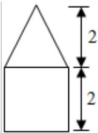
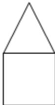
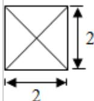

<!-- question-source:start -->
2. (5 分) (2015·浙江) 某几何体的三视图如图所示 (单位: cm), 则该几何体的体积是 ( )

  
主视图

  
侧视图

俯视图A. $8\mathrm{cm}^3$ B. $12\mathrm{cm}^3$ C. $\frac{32}{3}\mathrm{cm}^3$ D. $\frac{40}{3}\mathrm{cm}^3$
<!-- question-source:end -->

![[高中/真题/按年份分类/2015/2015年高考浙江文科数学试题及答案_精校版_/选择题/题目/answers/Q00023573A1.md]]
