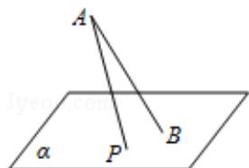

<!-- question-source:start -->
7. (5 分) (2015·浙江) 如图, 斜线段 AB 与平面 $\alpha$ 所成的角为 $60^{\circ}$ , B 为斜足, 平面 $\alpha$ 上的动点 P 满足 $\angle PAB = 30^{\circ}$ , 则点 P 的轨迹是 ( )

A. 直线 B. 抛物线 C. 椭圆 D. 双曲线的一支
<!-- question-source:end -->

![[高中/真题/按年份分类/2015/2015年高考浙江文科数学试题及答案_精校版_/选择题/题目/answers/Q00023578A1.md]]
