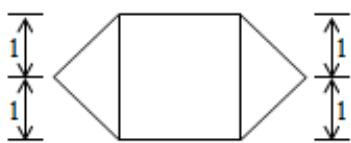

<!-- question-source:start -->
10. 一个几何体的三视图如图所示（单位：m），则该几何体的体积为 $\mathrm{m}^3$ 。

正视图  
侧视图  
  
俯视图
<!-- question-source:end -->

![[高中/真题/按年份分类/2015/2015年高考理科数学试题_天津卷_及参考答案/填空题/题目/answers/Q00026023A1.md]]
