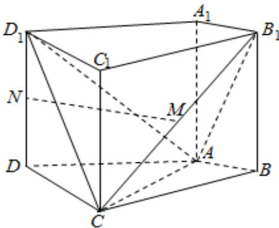

<!-- question-source:start -->
17．如图，在四棱柱 $ABCD - A_{1}B_{1}C_{1}D_{1}$ 中，侧棱 $A_{1}A \perp$ 底面
ABCD, $AB \perp AC$ , AB = 1, $AC = AA_{1} = 2$ ,

$AD = CD = \sqrt{5}$ ，且点 $M$ 和 $N$ 分别为 $B_{1}C$ 和 $D_{1}D$ 的中点.

(Ⅰ) 求证: $MN \parallel$ 平面 ABCD;

（II）求二面角 $D_{1} - AC - B_{1}$ 的正弦值；

（III）设 E 为棱 $A_{1}B_{1}$ 上的点。若直线 NE 和平面 ABCD 所成角的正弦值为 $\frac{1}{3}$ ，求线段 $A_{1}E$ 的长。
<!-- question-source:end -->

![[高中/真题/按年份分类/2015/2015年高考理科数学试题_天津卷_及参考答案/解答题/题目/answers/Q00026030A1.md]]
