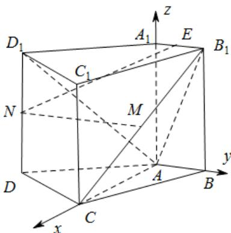

> [!faq]- 2015年高考理科数学试题(天津卷)及参考答案解析
>
> > [!success]- **【答案】** 见解析
>
> > [!note]- **【分析】**
> > 本题未单列分析。
>
> > [!note]- **【解析】**
> > 过程：
> >
> > 如图，以 $A$ 为原点建立空间直角坐标系，
> >
> > 
> >
> > 依题意可得 $A(0,0,0)$ ， $B(0,1,0)$ ， $C(2,0,0)$ ， $D(1,-2,0)$ ，
> >
> > $A_{1}(0,0,2)$ $B_{1}(0,1,2),C_{1}(2,0,2),D(1,-2,2)$
> >
> > 又因为 M,N 分别为 $B_{1}C$ 和 $D_{1}D$ 的中点，得 $M(1,\frac{1}{2},1)$ ， $N(1,-2,1)$ .
> >
> > （Ⅰ）证明：依题意，可得 $n=(0,0,1)$ 为平面 ABCD 的一个法向量.
> >
> > $\overline{MN} = (0, -\frac{5}{2}, 0)$ . 由此可得 $MN \cdot n = 0$
> >
> > 又因为直线 $MN \notin$ 平面 ABCD，所以 $MN \parallel$ 平面 ABCD。
> >
> > （Ⅱ）解： $\overline{AD_{1}}=(1,-2,2)$ ， $\overline{AC}=(2,0,0)$ .
> >
> > 设 $n_1 = (x, y, z)$ 为平面 $ACD_1$ 的法向量，则
> >
> > $\left\{ \begin{array}{l} n_{1} \square AD_{1} = 0, \\ n_{1} \square AC = 0, \end{array} \right.$ 即 $\left\{ \begin{array}{l} x - 2y + 2z = 0, \\ 2x = 0. \end{array} \right.$
> >
> > 不妨设 $z = 1$ ，可得 $n_1 = (0,1,1)$
> >
> > 设 $n_2 = (x,y,z)$ 为平面 $ACB_{1}$ 的法向量，则 $\left\{ \begin{array}{l} n_{1} \parallel AB_{1} = 0, \\ n_{1} \parallel AC = 0, \end{array} \right.$
> >
> > 又 $AB_{1} = (0,1,2)$ ，得 $\left\{ \begin{array}{l}y + 2z = 0,\\ 2x = 0. \end{array} \right.$
> >
> > 不妨设 z=1，可得 $n_{2}=(0,-2,1)$ .
> >
> > 因此有 $\cos\left\langle n_{1},n_{2}\right\rangle=\frac{n_{1}\square n_{2}}{\left|n_{1}\right|\left|n_{2}\right|}=-\frac{\sqrt{10}}{10}$ ，于是 $\sin\left\langle n_{1},n_{2}\right\rangle=\frac{3\sqrt{10}}{10}$ .
> >
> > 所以，二面角 $D_{1} - AC - B_{1}$ 的正弦值为 $\frac{3\sqrt{10}}{10}$ 。
> >
> > （III）解：依题意，可设 $A_{1}E = \lambda A_{1}B_{1}$ ，其中 $\lambda \in [0,1]$
> >
> > 则 $E(0, \lambda, 2)$ ，从而 $NE = (-1, \lambda + 2, 1)$ 。
> >
> > 又 $n = (0,0,1)$ 为平面ABCD的一个法向量，
> >
> > 由已知，得 $\cos \left\langle NE, n \right\rangle = \frac{\overrightarrow{NE} \cdot n}{\left| NE \right|\left| n \right|} = \frac{1}{\sqrt{(-1)^2 + (\lambda + 2)^2 + 1^2}} = \frac{1}{3}$ ，
> >
> > 整理得 $\lambda^2 + 4\lambda - 3 = 0$ ，又因为 $\lambda \in [0,1]$ ，解得 $\lambda = \sqrt{7} - 2$ 。
> >
> > 所以，线段 $A_{1}E$ 的长为 $\sqrt{7} - 2$ 。
