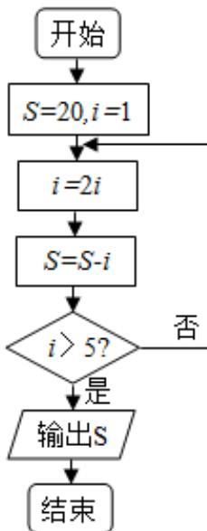

<!-- question-source:start -->
2. 设变量 $x, y$ 满足约束条件 $\left\lfloor 2x + y - 3 \leq 0\right\rfloor$ 则目标函数 $z = x + 6y$ 的最大值为（）A. 3 B. 4 C. 18 D. 40

<!-- question-source:end -->

![[高中/真题/按年份分类/2015/2015年高考理科数学试题_天津卷_及参考答案/选择题/题目/answers/Q00026016A1.md]]
