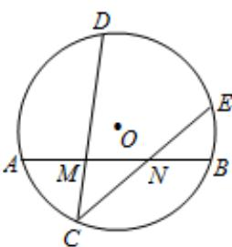

<!-- question-source:start -->
5. 如图，在圆 $O$ 中， $M, N$ 是弦 $AB$ 的三等分点，弦 $CD$ ， $CE$ 分别经过点 $M, N$ ，若 $CM = 2$ ， $MD = 4$ ， $CN = 3$ ，则线段 $NE$ 的长为（）

A. $\frac{8}{3}$ B. 3

C. $\frac{10}{3}$ D. $\frac{5}{2}$

<!-- question-source:end -->

![[高中/真题/按年份分类/2015/2015年高考理科数学试题_天津卷_及参考答案/选择题/题目/answers/Q00026019A1.md]]
