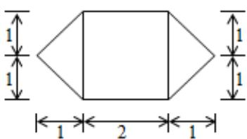
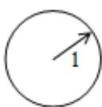

<!-- question-source:start -->
9. A. $\left(\frac{7}{4}+\infty\right)$ B. $\left(-\infty,\frac{7}{4}\right)$ C. $\left(0,\frac{7}{4}\right)$ D. $\left(\frac{7}{4},2\right)$

##
二、填空题

9. $i$ 是虚数单位，若复数 $(1 - 2i)(a + i)$ 是纯虚数，则实数 $a$ 的值为 \_\_\_\_.

<!-- question-source:end -->

![[高中/真题/按年份分类/2015/2015年高考理科数学试题_天津卷_及参考答案/选择题/题目/answers/Q00028447A1.md]]
