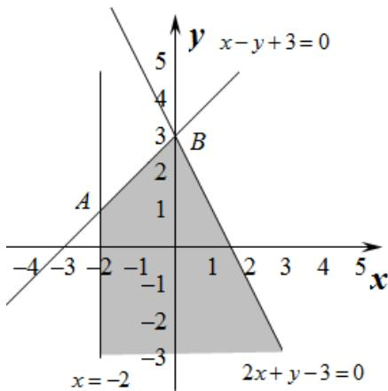

> [!faq]- 2015年高考理科数学试题(天津卷)及参考答案解析
>
> > [!success]- **【答案】** C
>
> > [!note]- **【分析】**
> > 本题未单列分析。
>
> > [!note]- **【解析】**
> > 过程：
> >
> > 不等式 $\left\{\begin{aligned}x+2&\geq0.\\ x-y+3&\geq0.\\ 2x+y-3&\leq0.\end{aligned}\right.$ 所表示的平面区域如下图所示，
> >
> > 
> >
> > 当 $z = x + 6y$ 所表示直线经过点 $B(0,3)$ 时， $z$ 有最大值18，选C
