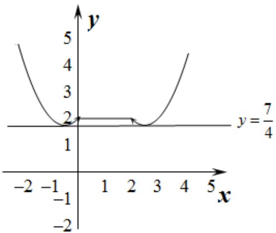

> [!faq]- 2015年高考理科数学试题(天津卷)及参考答案解析
>
> > [!success]- **【答案】** D
>
> > [!note]- **【分析】**
> > 本题未单列分析。
>
> > [!note]- **【解析】**
> > 过程:
> >
> > 由
> >
> > $$
> > f (x) = \left\{ \begin{array}{l l} 2 - | x |, & x \leq 2, \\ (x - 2) ^ {2}, & x > 2, \text {得} \end{array} f (2 - x) = \left\{ \begin{array}{l l} 2 - | 2 - x |, & x \geq 0 \\ x ^ {2}, & x <   0, \end{array} \right. \right.
> > $$
> >
> > 所以
> >
> > $$
> > y = f (x) + f (2 - x) = \left\{ \begin{array}{l l} 2 - | x | + x ^ {2}, & x <   0 \\ 4 - | x | - | 2 - x |, & 0 \leq x \leq 2 \\ 2 - | 2 - x | + (x - 2) ^ {2}, & x > 2 \end{array} \right.
> > $$
> >
> > 即
> >
> > $$
> > y = f (x) + f (2 - x) = \left\{ \begin{array}{l l} x ^ {2} + x + 2, & x <   0 \\ 2, & 0 \leq x \leq 2 \\ x ^ {2} - 5 x + 8, & x > 2 \end{array} \right.
> > $$
> >
> > $$
> > y = f (x) - g (x) = f (x) + f (2 - x) - b,
> > $$
> >
> > 所以 $y = f(x) - g(x)$ 恰有4个零点等价于方程
> >
> > $f(x) + f(2 - x) - b = 0$ 有4个不同的解，
> >
> > 即函数 $y = b$ 与函数 $y = f(x) + f(2 - x)$ 的图象的4个公共点，
> >
> > 由图象可知 $\frac{7}{4}<b<2$ .选 D
> >
> > 
> >
> > ## 二、填空题
