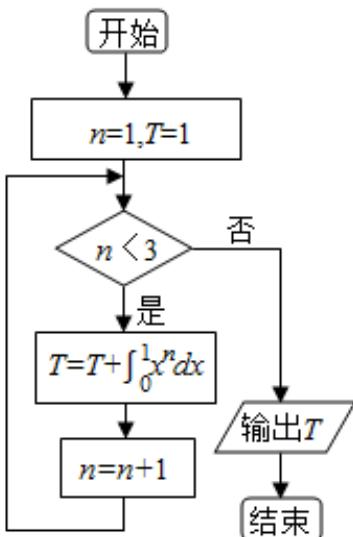

<!-- question-source:start -->
12. 若 “ $\forall x \in [0, \frac{\pi}{4}]$ , $\tan x \leq m$ ” 是真命题，则实数 $m$ 的最小值为 \_\_\_\_.

<!-- question-source:end -->

![[高中/真题/按年份分类/2015/2015年高考真题数学_理__山东卷__含解析版_/选择题/题目/answers/Q00025787A1.md]]
