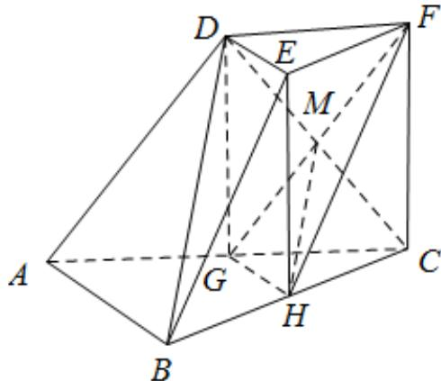
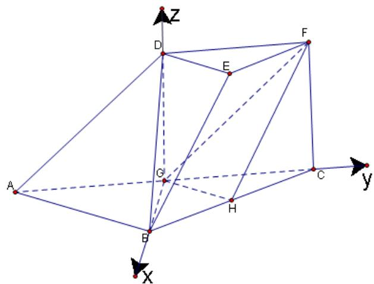
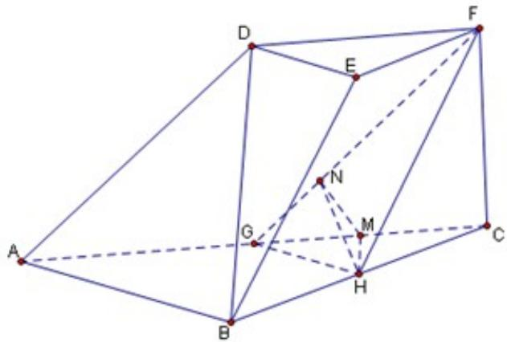

> [!faq]- 2015年高考真题数学【理】(山东卷)（含解析版）解析
>
> > [!success]- **【答案】** (I) 详见解析；(II) $60^{\circ}$
>
> > [!note]- **【分析】**
> > 本题未单列分析。
>
> > [!note]- **【解析】**
> > 过程：
> >
> > (I) 证法一：连接 DG, CD. 设 $CD \cap GF = M$ , 连接 MH,
> >
> > 在三棱台 DEF - ABC 中，AB = 2DE，G 分别为 AC 的中点，可得 DF // GC, DF = GC，所以四边形
> >
> > DFCG 是平行四边形，
> >
> > 则 M 为 CD 的中点，又 H 是 BC 的中点，所以 HM // BD，
> >
> > 又 $HM \subset$ 平面 FGH， $BD \notin$ 平面 FGH，所以 BD // 平面
> >
> > FGH.
> >
> > 
> >
> > 证法二：在三棱台 $DEF - ABC$ 中，
> >
> > 由 $BC = 2EF, H$ 为 $BC$ 的中点，
> >
> > 可得 $BH //EF, BH = EF,$
> >
> > 所以 HBEF 为平行四边形，可得 BE // HF.
> >
> > 在 $\Delta ABC$ 中， $G, H$ 分别为 $AC, BC$ 的中点，
> >
> > 所以 $GH \parallel AB,$ 又 $GH \cap HF = H$ ,
> >
> > 所以平面 $FGH \parallel$ 平面 ABED，
> >
> > 因为 $BD \subset$ 平面ABED，
> >
> > 所以 $BD / /$ 平面FGH.
> >
> > （Ⅱ）解法一：设 AB = 2 ，则 CF = 1
> >
> > 在三棱台 $DEF - ABC$ 中，
> >
> > $G$ 为 $AC$ 的中点
> >
> > $$
> > D F = \frac {1}{2} A C = G C
> > $$
> >
> > 可得四边形 DGCF 为平行四边形，
> >
> > 因此 $DG / / CF$
> >
> > 又 $FC \perp$ 平面 $ABC$
> >
> > 所以 $DG \perp$ 平面 $ABC$
> >
> > 在 $\Delta ABC$ 中，由 $AB \perp BC, \angle BAC = 45^{\circ}$ ， $G$ 是 $AC$ 中点，
> >
> > 所以 $AB = BC, GB \perp GC$
> >
> > 因此 GB, GC, GD 两两垂直,
> >
> > 以 G 为坐标原点，建立如图所示的空间直角坐标系
> >
> > G - xyz
> >
> > 所以 $G(0,0,0)$ , $B(\sqrt{2},0,0)$ , $C(0,\sqrt{2},0)$ , $D(0,0,1)$
> >
> > $$
> > H \left(\frac {\sqrt {2}}{2}, \frac {\sqrt {2}}{2}, 0\right), F (0, \sqrt {2}, 1)
> > $$
> >
> > 
> >
> > 故
> >
> > $$
> > G H = \left(\frac {\sqrt {2}}{2}, \frac {\sqrt {2}}{2}, 0\right), G F = (0, \sqrt {2}, 1)
> > $$
> >
> > 设 $n = (x,y,z)$ 是平面FGH的一个法向量，则
> >
> > 由 $\left\{ \begin{array}{l} n \cdot GH = 0, \\ n \cdot GF = 0, \end{array} \right.$ 可得 $\left\{ \begin{array}{l} x + y = 0 \\ \sqrt{2} y + z = 0 \end{array} \right.$
> >
> > 可得平面 $FGH$ 的一个法向量 $n = (1, - 1,\sqrt{2})$
> >
> > 因为 GB 是平面 ACFD 的一个法向量， $GB = \left( \sqrt{2}, 0, 0 \right)$
> >
> > $$
> > \cos <   G B, n > = \frac {G B \cdot n}{| G B | \cdot | n |} = \frac {\sqrt {2}}{2 \sqrt {2}} = \frac {1}{2}
> > $$
> >
> > 所以
> >
> > 所以平面与平面所成的解(锐角)的大小为 $60^{\circ}$
> >
> > 解法二：
> >
> > 作 $HM \perp AC$ 于点 M ，作 $MN \perp GF$ 于点 N ，连接
> >
> > NH
> >
> > 由 $FC \perp$ 平面 $ABC$ ，得 $HM \perp FC$
> >
> > 又 $FC\cap AC = C$
> >
> > 所以 $HM \perp$ 平面ACFD
> >
> > 因此 $GF \perp NH$
> >
> > 所以 $\angle MNH$ 即为所求的角
> >
> > 
> >
> > 在 $\Delta BGC$ 中， $MH // BG, MH = \frac{1}{2} BG = \frac{\sqrt{2}}{2}$ ，
> >
> > 由 $\Delta GNM \sim \Delta GCF$ 可得 $\frac{MN}{FC} = \frac{GM}{GF}$ ,
> >
> > 从而 $MN = \frac{\sqrt{6}}{6}$ ，由 $MH \perp$ 平面 $ACFD$ ， $MN \subset$ 平面 $ACFD$ 得
> >
> > $MH \perp MN$ ，所以 $\tan\angle MNH = \frac{HM}{MN} = \sqrt{3}$ ，所以 $\angle MHN = 60^{0}$
> >
> > 所以平面 $FGH$ 与平面 $ACFD$ 所成角（锐角）的大小为 $60^{\circ}$
