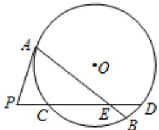

<!-- question-source:start -->
14．如图，圆 O 的弦 AB，CD 相交于点 E，过点 A 作圆 O 的切线与 DC 的延长线交于点 P，若 PA=6，AE=9，PC=3，CE:ED=2:1，则 BE=\_\_\_\_.

<!-- question-source:end -->

![[高中/真题/按年份分类/2015/2015年高考重庆理科数学试题及答案_精校版_/填空题/题目/answers/Q00025630A1.md]]
