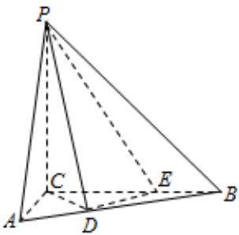

<!-- question-source:start -->
19. 如图，三棱锥 $P - ABC$ 中， $PC \perp$ 平面 $ABC, PC = 3, \angle ACB = \frac{\pi}{2}. D, E$ 分别为线段 $AB, BC$ 上的点，且 $CD = DE = \sqrt{2}, CE = 2EB = 2$ .

(Ⅰ) 证明: $DE \perp$ 平面 $PCD$

（Ⅱ）求二面角 $A - PD - C$ 的余弦值。

<!-- question-source:end -->

![[高中/真题/按年份分类/2015/2015年高考重庆理科数学试题及答案_精校版_/填空题/题目/answers/Q00025635A1.md]]
