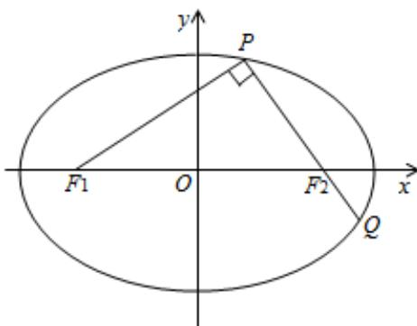

<!-- question-source:start -->
21. 如图，椭圆 $\frac{x^{2}}{a^{2}}+\frac{y^{2}}{b^{2}}=1(a>b>0)$ 的左、右焦点分别为 $F_{1}, F_{2}$ ，过 $F_{2}$ 的直线交椭圆于 P, Q 两点，且 $PQ \perp PF_{1}$

（1）若 $\left|PF_{1}\right|=2+\sqrt{2},\left|PF_{2}\right|=2-\sqrt{2}$ 求椭圆的标准方程

(II) 若 $\left|PF_{1}\right|=\left|PQ\right|$ ，求椭圆的离心率 e.

<!-- question-source:end -->

![[高中/真题/按年份分类/2015/2015年高考重庆理科数学试题及答案_精校版_/填空题/题目/answers/Q00025637A1.md]]
