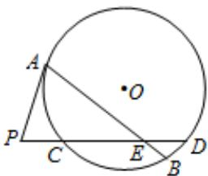

> [!faq]- 2015年高考重庆理科数学试题及答案(精校版)解析
>
> > [!success]- **【答案】** $\sqrt{6}$
>
> > [!note]- **【分析】**
> > 本题未单列分析。
>
> > [!note]- **【解析】**
> > 过程:
> >
> > 由正弦定理得 $\frac{AB}{\sin\angle ADB}=\frac{AD}{\sin B}$ ,
> >
> > 即 $\frac{\sqrt{2}}{\sin\angle ADB} = \frac{\sqrt{3}}{\sin120^{\circ}}$
> >
> > 解得 $\sin\angle ADB=\frac{\sqrt{2}}{2}$ ， $\angle ADB=45^{\circ}$
> >
> > 从而 $\angle BAD = 15^{\circ} = \angle DAC$
> >
> > 所以 $C = 180^{\circ} - 120^{\circ} - 30^{\circ} = 30^{\circ}$
> >
> > $$
> > \vert A C \vert = 2 \vert A B \vert \cos 3 0 ^ {\circ} = \sqrt {6}
> > $$
> >
> > 
