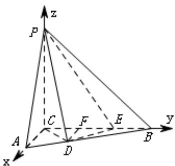

> [!faq]- 2015年高考重庆理科数学试题及答案(精校版)解析
>
> > [!success]- **【答案】** 见解析
>
> > [!note]- **【分析】**
> > 本题未单列分析。
>
> > [!note]- **【解析】**
> > 过程：
> >
> > (I)证明：
> >
> > 由 $PC \perp$ 平面 $ABC$ ， $DE \subset$ 平面 $ABC$ ，故 $PC \perp DE$ 。
> >
> > 由 $CE = 2, CD = DE = \sqrt{2}$
> >
> > 得 $\triangle CDE$ 为等腰直角三角形，故 $CD \perp DE$
> >
> > 由 $PC \cap CD = C$ ， $DE$ 垂直于平面 $PCD$ 内两条相交直线，
> >
> > 故 $DE \perp$ 平面 $PCD$
> >
> > 
> >
> > (Ⅱ)由（Ⅰ）知， $\triangle CDE$ 为等腰直角三角形， $\angle DCE = \frac{\pi}{4}$ .
> >
> > 过 D 作 DF 垂直 CE 于 F .
> >
> > 易知 DF = FC = FE = 1,
> >
> > 又已知 $EB = 1$ ，故 $FB = 2$
> >
> > 由 $\angle ACB=\frac{\pi}{2}$ 得 $DF\parallel AC$ ,
> >
> > $$
> > \frac {D F}{A C} = \frac {F B}{B C} = \frac {2}{3}, \text {故} A C = \frac {3}{2} D F = \frac {3}{2}.
> > $$
> >
> > 以 $C$ 为坐标原点，分别以 $CA, CB, CP$ 的方向
> >
> > 为 $x$ 轴, $y$ 轴, $z$ 轴的正方向建立空间直角坐标系,
> >
> > 则 $C(0,0,0),P(0,0,3),A(\frac{3}{2},0,0),E(0,2,0),D(1,1,0)$
> >
> > $ED=(1,-1,0), DP=(-1,-1,3), \quad DA=(\frac{1}{2},-1,0).$
> >
> > 设平面 $PAD$ 的法向量为 $n_{1}=(x,y,z)$ ,
> >
> > 由 $n_1 \square DP = 0, n_1 \square DA = 0,$ 得
> >
> > $$
> > \left\{ \begin{array}{c} - x _ {1} - y _ {1} + 3 z _ {1} = 0 \\ \frac {1}{2} x _ {1} - y _ {1} = 0 \end{array} \right.
> > $$
> >
> > 故可取 $n_1 = (2,1,1)$
> >
> > 由（Ⅰ）可知 $DE \perp$ 平面 $PCD$ ，
> >
> > 故平面 $PCD$ 的法向量 $n_2$ 可取为 $ED$ , 即 $n_2 = (1, -1, 0)$ ,
> >
> > 从而法向量 $n_1, n_2$ 的夹角的余弦值为
> >
> > $$
> > \cos \left\langle n _ {1}, n _ {2} \right\rangle = \frac {\rightarrow n _ {1} \square n _ {2}}{| n _ {1} | | n _ {2} |} = \frac {\sqrt {3}}{6}
> > $$
> >
> > 故所求二面角的余弦值为 $^{6}$
> >
> > $$
> > \frac {\sqrt {3}}{6}
> > $$
