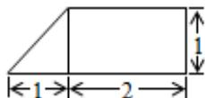
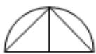
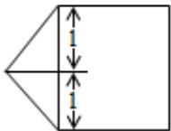

<!-- question-source:start -->
5. 某几何体的三视图如图所示，则该几何体的体积为（）

  
正视图

  
左视图

  
俯视图

A. $\frac{1}{3} +\pi$ B. $\frac{2}{3} +\pi$ C. $\frac{1}{3} +2\pi$ D. $\frac{2}{3} +2\pi$

$$
| \mathbf {a} | = \frac {2 \sqrt {2}}{3} | \mathbf {b} |
$$
<!-- question-source:end -->

![[高中/真题/按年份分类/2015/2015年高考重庆理科数学试题及答案_精校版_/选择题/题目/answers/Q00025622A1.md]]
