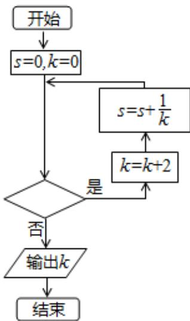

<!-- question-source:start -->
7. 执行如图所示的程序框图，若输入 K 的值为 8，则判断框图可填入的条件是（）

A. $s \leq \frac{3}{4}$ B. $s \leq \frac{5}{6}$ C. $s \leq \frac{11}{12}$ D. $s \leq \frac{15}{24}$
<!-- question-source:end -->

![[高中/真题/按年份分类/2015/2015年高考重庆理科数学试题及答案_精校版_/选择题/题目/answers/Q00025624A1.md]]
