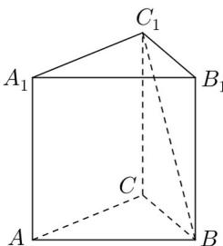

<!-- question-source:start -->
25. 如图，已知正三棱柱 $ABC - A_{1}B_{1}C_{1}$ 的体积为 $9\sqrt{3}$ ，底面边长为 3，求异面直线 $BC_{1}$ 与 $AC$ 所成的角的大小；

<!-- question-source:end -->

![[高中/真题/按年份分类/2016/2016年上海高三数学春考试卷_含答案_/解答题/题目/answers/Q00023940A1.md]]
